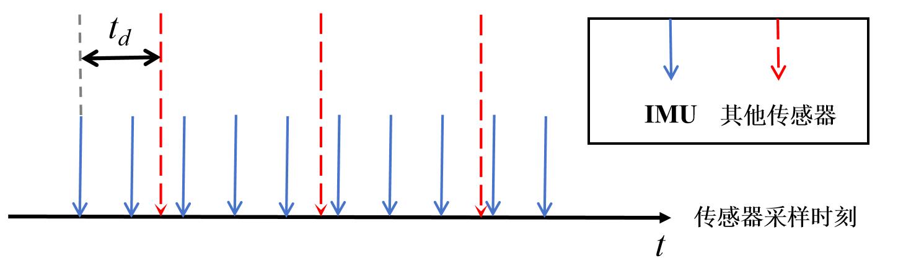
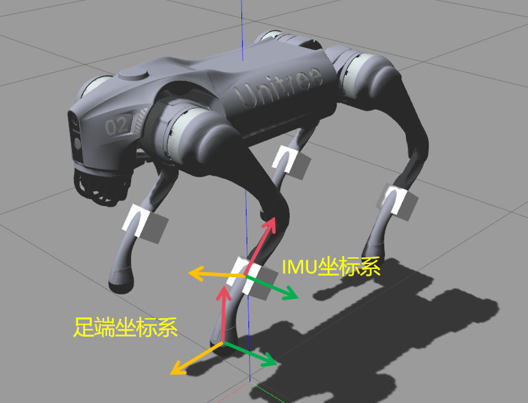
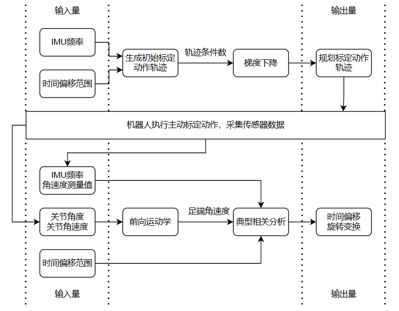
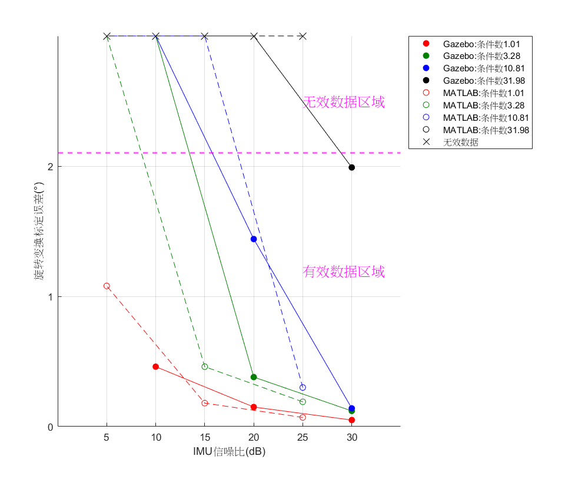

# ASTPIC: Active Spatial Temporal Proprioceptive IMU Calibration for Legged Robots
## 论文摘要
足式机器人具有较强的机动性和灵活性，对非结构化地形有较强的适应能力，能完成多种复杂任务，被认为是具身智能技术实现的重要载体。足式机器人需要利用多节点IMU对机体进行状态估计以实现本体感知，因此需要先对多节点IMU进行标定，其中两个待标定的重要参数是IMU相对于机械腿关节编码器的时间偏移以及IMU坐标系相对于机械腿足端坐标系的旋转变换。目前的多节点IMU标定技术大多采用被动标定策略，由于以下原因难以应用于足式机器人：1）标定算法大多基于刚体约束假设，不适用于足式机器人；2）被动标定无法控制标定结果对噪声的敏感程度，使标定精度易受传感器噪声影响；3）被动标定需要人工参与，过程随机性较大且自动化程度低，存在诸多非便利性。

|  |  |
| :--: | :--: |
| 传感器时间偏移 | 待标定旋转变换 |

为解决上述问题，本文提出了一种针对足式机器人多节点IMU的主动标定方法，首先基于正向运动学和典型相关分析理论，在刚体约束假设退化条件下，推导了IMU待标定的时间偏移参数和旋转变换参数的求解流程；然后基于矩阵条件数分析，设计了机器人腿部各个关节的运动轨迹，实现了主动标定动作的最优化；最后将算法部署至MATLAB和Gazebo仿真平台进行实验验证。实验表明，本文方法实现了足式机器人多节点IMU的主动标定，降低了标定过程对噪声干扰的敏感程度，提高了标定精度，提高了标定过程的自动化程度。在本文仿真实验环境中，当IMU信噪比为5dB时，本文方法的时间偏移标定误差不超过1个IMU采样间隔，旋转变换标定误差约为1°，证明了本文方法的有效性和鲁棒性。

|  | []iamge/demo.gif) |  |
| :--: | :--: | :--: |
| 算法框架 | 最优化标定动作演示 | 旋转变换标定误差 |

**作者：蒋方誉，上海交通大学，感知与导航研究所**

## 仓库介绍
本仓库主要包括了在MATLAB进行本课题数值模拟的代码文件，其中*two_joints_calibration.m*基于正向运动学和典型相关分析求解IMU待标定的时间偏移和旋转变换，*cond_num_optimization.m*基于矩阵条件数分析设计机器人腿部各个关节的运动轨迹。
